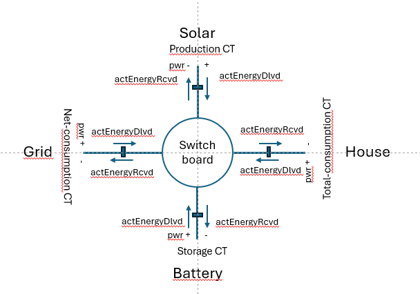
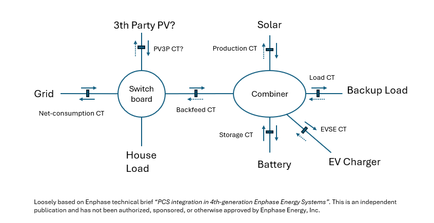

# Current Transformer Data

This section documents CT data for Envoy‑metered systems via {py:class}`~pyenphase.models.meters.EnvoyMeterData`.

Depending on how many and which CT are installed, data is available in:

- {py:attr}`pyenphase.EnvoyData.ctmeters`[{py:attr}`~pyenphase.models.meters.CtType`]

Legacy per‑type attributes remain for compatibility:

- {py:attr}`pyenphase.EnvoyData.ctmeter_production`
- {py:attr}`pyenphase.EnvoyData.ctmeter_consumption`
- {py:attr}`pyenphase.EnvoyData.ctmeter_storage`

These map to their counterparts {py:attr}`pyenphase.EnvoyData.ctmeters`[{py:attr}`~pyenphase.models.meters.CtType`]. In some future version these may be deprecated.

There are multiple CT types that can be installed. The CT meter types are enumerated as `production`, `storage`, `net-consumption`, `total-consumption`, `backfeed`, `load`, `evse` and `pv3p` by {py:class}`pyenphase.models.meters.CtType`. One or more of these can be installed and enabled. For multi-phase configurations, there will be one per phase.

```python
    data: EnvoyData = await envoy.update()

    production_ct = data.ctmeters[CtType.PRODUCTION]

    print(f'eid: {production_ct.eid}')
    print(f'timestamp: {production_ct.timestamp}')
    print(f'energy_delivered: {production_ct.energy_delivered}')
    print(f'energy_received: {production_ct.energy_received}')
    print(f'power_factor: {production_ct.power_factor}')
    print(f'active_power: {production_ct.active_power}')
    print(f'voltage: {production_ct.voltage}')
    print(f'current: {production_ct.current}')
    print(f'frequency: {production_ct.frequency}')
    print(f'state: {production_ct.state}')
    print(f'measurement_type: {production_ct.measurement_type}')
    print(f'metering_status: {production_ct.metering_status}')
    print(f'status_flags: {production_ct.status_flags}')

```

To detect how many CTs are installed, use the Envoy property {py:attr}`~pyenphase.Envoy.ct_meter_count`. You can identify which CT meters are available via {py:attr}`pyenphase.Envoy.ct_meter_list`. To test presence of individual CT meters use {py:meth}`pyenphase.Envoy.meter_type` with a {py:class}`~pyenphase.models.meters.CtType` argument.

The consumption CT can be either `net-consumption` (installed at the grid boundary) or `total-consumption` (measuring house load); see [ct-model](#ct-model) below. Which one is installed, is available in {py:attr}`pyenphase.Envoy.consumption_meter_type`. The IQ Metered collar includes an embedded `net-consumption` CT.

```python
    how_many_ct = envoy.ct_meter_count
    meter_list = envoy.ct_meter_list

    consumption_ct = 'installed' if envoy.consumption_meter_type else 'not installed'
    production_ct = 'installed' if envoy.meter_type(CtType.PRODUCTION) else 'not installed'
    storage_ct = 'installed' if CtType.STORAGE in meter_list else 'not installed'

    print(f'This Envoy has Production CT {production_ct}, Consumption CT {consumption_ct}, and Storage CT {storage_ct}')
```

## Consumption CT options

The consumption CT can be installed in two configurations: `Solar + Load` or `Load only`. The attribute {py:attr}`~pyenphase.Envoy.consumption_meter_type` indicates whether the CT is operating in `net-consumption` or `total-consumption` mode.

In `net-consumption` mode, {py:attr}`~pyenphase.models.meters.EnvoyMeterData.energy_delivered` reports cumulative site import (energy received from the grid), while {py:attr}`~pyenphase.models.meters.EnvoyMeterData.energy_received` reports cumulative site export (energy sent to the grid).[^1][^2] In `total-consumption` mode, the CT reports only the house load.

{py:attr}`~pyenphase.models.meters.EnvoyMeterData.active_power` is the instantaneous power; its sign reflects the direction of energy flow.

[^1]: Provided the CT is installed on the main grid entry. Refer to the [CT Model](#ct-model) for delivered and received directions.

[^2]: Variations between firmware releases may exist.

```python

if (cttype := data.consumption_meter_type) == CtType.NET_CONSUMPTION:
    grid_import = data.ctmeters[cttype].energy_delivered
    grid_export = data.ctmeters[cttype].energy_received
    grid_power = data.ctmeters[cttype].active_power
else:
    print("No net consumption CT installed")
```

## Production CT Options

The production CT measures solar production. {py:attr}`~pyenphase.models.meters.EnvoyMeterData.energy_delivered` reports the energy generated by the solar array, while {py:attr}`~pyenphase.models.meters.EnvoyMeterData.energy_received` reports energy consumed by the solar hardware. The latter is typically minimal (e.g., inverter consumption during dawn and dusk).[^2]

## Storage CT Options

The storage CT measures battery charge and discharge. {py:attr}`~pyenphase.models.meters.EnvoyMeterData.energy_delivered` reports energy discharged from the battery, while {py:attr}`~pyenphase.models.meters.EnvoyMeterData.energy_received` reports energy charged to the battery.[^2]

## Backfeed CT Options

The backfeed CT measures energy fed back from the Combiner to the switchboard. {py:attr}`~pyenphase.models.meters.EnvoyMeterData.energy_delivered` reports energy fed back, while {py:attr}`~pyenphase.models.meters.EnvoyMeterData.energy_received` reports received from the switchboard.[^2]

## Load CT Options

The load CT measures energy flow between the combiner and backup loads (installations may vary with backup and non‑backup loads). Per the CT Model, {py:attr}`~pyenphase.models.meters.EnvoyMeterData.energy_delivered` is energy towards the switchboard, and {py:attr}`~pyenphase.models.meters.EnvoyMeterData.energy_received` is energy from the switchboard.[^2]

## EVSE CT Options

The EVSE CT measures energy flow between the combiner and the EV charger. Per the CT Model, {py:attr}`~pyenphase.models.meters.EnvoyMeterData.energy_delivered` is energy towards the switchboard, and {py:attr}`~pyenphase.models.meters.EnvoyMeterData.energy_received` is energy from the switchboard.[^2]

## PV3P CT Options

The PV3P CT measures solar production by third party PV. {py:attr}`~pyenphase.models.meters.EnvoyMeterData.energy_delivered` reports the energy generated by the solar array, while {py:attr}`~pyenphase.models.meters.EnvoyMeterData.energy_received` reports energy consumed by the solar hardware. The latter is typically minimal (e.g., consumption during dawn and dusk).[^2]

## CT Model

Below is a generic model for installed CTs. Each CT can be considered as facing the switchboard and reporting energy delivered to the switchboard in its `energy_delivered` property and energy received from the switchboard in `energy_received`. Power is positive towards the switchboard and negative from the switchboard.



These properties have different meaning for each specific CT. For a net-consumption CT, delivered is import from the grid, for Solar production CT, it is solar production and for a battery CT it is battery discharge. A total-consumption CT typically has no delivery but only receives what is consumed by the house.

When a combiner is used, several other CT types may be available.



> NOTE
>
> - This in no way represents a configuration direction, as actual configuration is driven by local rules, installer designs and Enphase installation guidelines. Variations may exist, based on specific needs or rules. This merely describes a simplified view and naming conventions used in this documentation to clarify integration operation. Refer to [Enphase documentation](https://enphase.com/installers/resources/documentation/communication) for more information.
> - Some element positions, including PV3P, are assumed positions and still need confirmation.
> - This is an independent publication and has not been authorized, sponsored, or otherwise approved by Enphase Energy, Inc. It is loosely based on Enphase technical brief “PCS integration in 4th-generation Enphase Energy Systems”.

## Dual CT attributes, single production report attribute

An Envoy metered with CTs installed, sources production and consumption data from the CT meters. The [system_production](data_production.md#system_production-data) data is collected from the production CT. The [system_consumption](data_consumption.md#system_consumption-data) data represents total house load and is either collected from the consumption CT in `total-consumption` mode or calculated by the Envoy from both production and consumption CTs when the consumption CT is in `net-consumption` mode.

A single increasing/decreasing total of import and export is reported by the [`/production.json?details=1`](endpoint_json.md#productionjsondetails1) in `net-consumption` as `whLifetime` for energy and `wNow` for power. CT readings provide two monotonically increasing energy properties, `actEnergyDlvd` and `actEnergyRcvd`; power is reported in a single value `activePower`.

## Multi-phase CT

For [metered Envoy with multi‑phase installations](./phase_data.md#phase-data), CT phase data is available in:

- {py:attr}`pyenphase.EnvoyData.ctmeters_phases`[{py:class}`~pyenphase.models.meters.CtType`][{py:class}`~pyenphase.const.PhaseNames`]

Legacy per‑type attributes remain for compatibility:

- {py:attr}`pyenphase.EnvoyData.ctmeter_production_phases`
- {py:attr}`pyenphase.EnvoyData.ctmeter_consumption_phases`
- {py:attr}`pyenphase.EnvoyData.ctmeter_storage_phases`

Phase data is only populated if CTs are installed on more than 1 phase for production and/or consumption phases.

To detect if multiple phases are reporting, use the Envoy property {py:attr}`~pyenphase.Envoy.phase_count`.

```python
    data: EnvoyData = await envoy.update()

    if envoy.phase_count > 1:
        for phase, phase_data in data.ctmeters_phases.get(CtType.PRODUCTION, {}).items():
            for key, value in vars(phase_data).items():
                print(f'{phase} {key}: {value}')
```

## Data sources

The data is provided by the [updaters](updaters.md) below.

This data set is identified by the {py:class}`pyenphase.const.SupportedFeatures` flag {py:attr}`~pyenphase.const.SupportedFeatures.CTMETERS`. In addition it returns {py:attr}`~pyenphase.const.SupportedFeatures.THREEPHASE` or {py:attr}`~pyenphase.const.SupportedFeatures.DUALPHASE` to signal if a multi-phase mode is active.

### {py:class}`~pyenphase.updaters.meters.EnvoyMetersUpdater`

This is the default updater for CT data. It provides data for aggregated phases and individual phases. Data is measured/calculated by the Envoy.

|                                                                     |                                                                          |     |
| ------------------------------------------------------------------- | ------------------------------------------------------------------------ | --- |
| endpoint config                                                     | [`/ivp/meters`](endpoint_json.md#ivpmeters)                              |     |
| endpoint data                                                       | [`/ivp/meters/readings`](endpoint_json.md#ivpmetersreadings)             |     |
| json path config                                                    | `$`                                                                      |     |
| eid of production                                                   | `[?(@.measurementType=='production' && @.state=='enabled')][eid]`        |     |
| eid of consumption                                                  | `[?(@.measurementType=='net-consumption' && @.state=='enabled')][eid]`   |     |
|                                                                     | `[?(@.measurementType=='total-consumption' && @.state=='enabled')][eid]` |     |
| eid of storage                                                      | `[?(@.measurementType=='storage' && @.state=='enabled')][eid]`           |     |
| json path aggregated                                                | `[?(@.eid==<eid of ....>)]`                                              |     |
| json path phases                                                    | `[?(@.eid==<eid of ....>)].channels[*]`                                  |     |
|                                                                     |                                                                          |     |
| class data                                                          | json node                                                                | uom |
| {py:attr}`~pyenphase.models.meters.EnvoyMeterData.eid`              | eid                                                                      |     |
| {py:attr}`~pyenphase.models.meters.EnvoyMeterData.timestamp`        | timestamp                                                                |     |
| {py:attr}`~pyenphase.models.meters.EnvoyMeterData.energy_delivered` | actEnergyDlvd                                                            | Wh  |
| {py:attr}`~pyenphase.models.meters.EnvoyMeterData.energy_received`  | actEnergyRcvd                                                            | Wh  |
| {py:attr}`~pyenphase.models.meters.EnvoyMeterData.active_power`     | activePower                                                              | W   |
| {py:attr}`~pyenphase.models.meters.EnvoyMeterData.power_factor`     | pwrFactor                                                                |     |
| {py:attr}`~pyenphase.models.meters.EnvoyMeterData.voltage`          | voltage                                                                  | V   |
| {py:attr}`~pyenphase.models.meters.EnvoyMeterData.current`          | current                                                                  | A   |
| {py:attr}`~pyenphase.models.meters.EnvoyMeterData.frequency`        | freq                                                                     | Hz  |
| {py:attr}`~pyenphase.models.meters.EnvoyMeterData.state`            | state                                                                    |     |
| {py:attr}`~pyenphase.models.meters.EnvoyMeterData.measurement_type` | measurementType                                                          |     |
| {py:attr}`~pyenphase.models.meters.EnvoyMeterData.metering_status`  | meteringStatus                                                           |     |
| {py:attr}`~pyenphase.models.meters.EnvoyMeterData.status_flags`     | statusFlags                                                              |     |
