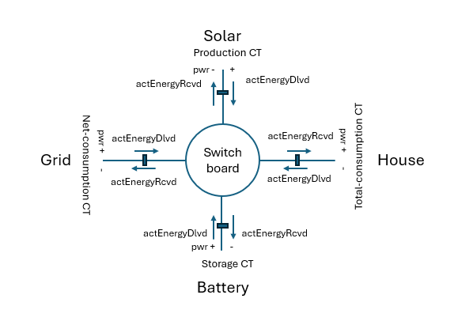

# Current Transformer Data

This is the data for installed current transformers (CT) for an Envoy-metered. Class [EnvoyMeterData](#pyenphase.models.meters.EnvoyMeterData).

Depending on how many and which CT are installed, data is available in:

- [Envoy.data.ctmeter_production](#pyenphase.EnvoyData.ctmeter_production)
- [Envoy.data.ctmeter_consumption](pyenphase.EnvoyData.ctmeter_consumption)
- [Envoy.data.ctmeter_storage](pyenphase.EnvoyData.ctmeter_storage)
- [Envoy.data.ctmeter_production_phases](pyenphase.EnvoyData.ctmeter_production_phases)
- [Envoy.data.ctmeter_consumption_phases](pyenphase.EnvoyData.ctmeter_consumption_phases)
- [Envoy.data.ctmeter_storage_phases](pyenphase.EnvoyData.ctmeter_storage_phases)

There is one ct for production, one for consumption and one for battery storage. One, 2 or all of these can be installed and enabled. Data is only available if CT's are enabled. Consumption CT can either be `net-consumption` installed on grid boundary or `total-consumption` measuring house load, see [ct-model](#ct-model) below.

```python
    data: EnvoyData = await envoy.update()

    production_ct = data.ctmeter_production

    print(f'eid: {production_ct.eid}')
    print(f'timestamp: {production_ct.timestamp}')
    print(f'energy_delivered: {production_ct.energy_delivered}')
    print(f'energy_received: {production_ct.energy_received}')
    print(f'power_factor: {production_ct.power_factor}')
    print(f'active_power: {production_ct.active_power}')
    print(f'voltage: {production_ct.voltage}')
    print(f'current: {production_ct.current}')
    print(f'frequency: {production_ct.frequency}')
    print(f'state: {production_ct.state}')
    print(f'measurement_type: {production_ct.measurement_type}')
    print(f'metering_status: {production_ct.metering_status}')
    print(f'status_flags: {production_ct.status_flags}')

```

To detect how many CT are installed use Envoy property [ct_meter_count](#pyenphase.Envoy.ct_meter_count). One can identify which CT meters are available by testing the [envoy.production_meter_type](#pyenphase.Envoy.production_meter_type), [envoy.consumption_meter_type](pyenphase.Envoy.consumption_meter_type) or [envoy.storage_meter_type](pyenphase.Envoy.storage_meter_type)

```python
    how_many_ct = envoy.ct_meter_count

    consumption_ct = 'installed' if envoy.production_meter_type else 'not installed'
    procuction_ct = 'installed' if envoy.consumption_meter_type else 'not installed'
    storage_ct = 'installed' if envoy.storage_meter_type else 'not installed'

    print(f'This envoy has Production ct {procuction_ct}, Consumption CT {consumption_ct} and Storage CT {storage_ct}')

```

## Consumption CT options

The consumption CT can be installed in 1 of 2 configurations. Either `Solar + Load` or `Load only`. The property [Envoy.consumption_meter_type](#pyenphase.Envoy.consumption_meter_type) will show in [which mode](#pyenphase.models.meters.CtType) the CT is operating, either `net-consumption`or `total-consumption`.

When in `net-consumption` mode, the [energy_delivered](#pyenphase.models.meters.EnvoyMeterData.energy_delivered) property reports net-energy _delivered to your site/received from the grid_ while [energy_received](#pyenphase.models.meters.EnvoyMeterData.energy_received) reports net-energy _recived from your site/send to the grid_ to the grid.[^1] [^2] When in `total-consumption` it only reports on the load (house) consumption.

[Active_power](#pyenphase.models.meters.EnvoyMeterData.active_power) is the current power flow and will be positive or negative based on actual flow of energy.

[^1]: Provided the CT is installed on the main grid entry.
[^2]: Variations between firmware release may exist.

```python

    net_consumption = envoy.data.consumption_ct.energy_delivered
    net_production = envoy.data.consumption_ct.energy_received
    net_power = envoy.data.consumption_ct.active_power

```

## Production CT Options

The production CT is installed to measure solar production. The [energy_delivered](#pyenphase.models.meters.EnvoyMeterData.energy_delivered) property reports the energy generated by the solar while [energy_received](#pyenphase.models.meters.EnvoyMeterData.energy_received) reports energy consumed by the solar. The latter will be minimal and is the consumption by the inverters when it exceeds the solar production, typically only during dawn and dusk periods. [^2]

## Storage CT Options

The storage CT is installed to measure battery charge and discharge. The [energy_delivered](#pyenphase.models.meters.EnvoyMeterData.energy_delivered) property reports the energy discharged from the battery while [energy_received](#pyenphase.models.meters.EnvoyMeterData.energy_received) reports energy charged to battery. [^2]

## Relation to System Production and Consumption

An Envoy metered with CT installed, sources the production and consumption data from the CT meters. The [system_production](data_production.md#system_production-data) data is sourced from the production CT. The [system_consumption](data_consumption.md#system_consumption-data) is total consumption by the load/house and is either sourced from the consmption CT in `total-consumption` mode or calculated from both production and consumption CT when in consumption CT is in `net-consumption` mode.

Net-consumption is reported in /production as an increasing/decreasing total of import and export, CT readings however provides these as 2 increasing properties. Production is reported in system_production as a single value as well.

## Multi phase

Phase data is only populated if CT's are installed on more then 1 phase for production and/or consumption phases. If the configuration is in `split phase` mode, no phases are reported for production and consumption reports, but are for CT specific data.

To detect if multiple phases are reporting use the Envoy property [phase_count](#pyenphase.Envoy.phase_count).

```python
    from pyenphase.const import PhaseNames

    data: EnvoyData = await envoy.update()

    if Envoy.phase_count > 1:
        for phase in data.ctmeter_production_phases:
            phase_data = data.ctmeter_production_phases[phase]
            for key in phase_data:
                print(f'{phase} {key}: [phase_data{key]}
```

## CT Model

Below a generic model for installed CT's. Each CT can be considered as facing the switch-board and reporting energy delivered to the switchboard in it's `energy_delivered` property and energy received from the switchboard in `energy_received`. Power is positive towards the switchboard and negative from the switchboard.



These properties have different meaning for each specific CT. For a net-consumption CT, delivered is import from the grid, for Solar production CT, it is solar production and for a battery CT it is battery discharge. A total-consumption CT typically has no delivery but only receives what is consumed by the house.
